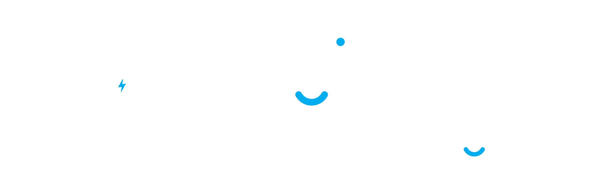

# EngineersGadget - Premium Tech Gadgets & Engineering Tools E-Commerce

A modern, full-featured e-commerce platform for tech gadgets, electronics, and engineering tools built with Next.js 16, React 19, and MongoDB.

🌐 **Live Demo:** [engineersgadget.tech](https://engineersgadget.tech)



## ✨ Features

### 🛍️ Shopping Experience
- **Product Catalog** - Browse Arduino, Raspberry Pi, sensors, microcontrollers, IoT devices & more
- **Advanced Filtering** - Filter by category, price range, colors, and badges
- **Product Search** - Real-time search across all products
- **Wishlist** - Save favorite items for later
- **Shopping Cart** - Persistent cart with quantity management
- **Responsive Design** - Optimized for mobile, tablet, and desktop

### 👤 User Features
- **Authentication** - Email/password and Google OAuth login
- **User Profiles** - Manage account details and preferences
- **Order History** - Track all past orders
- **Secure Checkout** - Multi-step checkout with address management

### 🔧 Admin Panel
- **Dashboard** - Sales analytics and overview
- **Product Management** - Add, edit, delete products with image upload
- **Category Management** - Organize products by categories
- **Order Management** - View and update order status
- **Customer Management** - View and manage users
- **Coupon System** - Create and manage discount coupons
- **Settings** - Configure shipping, store settings

### ⚡ Performance & SEO
- **Smart Caching** - React Query with configurable cache times
- **Redux State** - Centralized state management
- **SEO Optimized** - Meta tags, Open Graph, structured data
- **Sitemap** - Auto-generated sitemap for search engines

## 🛠️ Tech Stack

| Category | Technology |
|----------|------------|
| **Framework** | Next.js 16 (App Router) |
| **Frontend** | React 19, TypeScript |
| **Styling** | Tailwind CSS 4 |
| **State Management** | Redux Toolkit, React Query |
| **Database** | MongoDB |
| **Authentication** | NextAuth.js |
| **Animations** | Framer Motion |
| **Icons** | Lucide React |
| **Image Upload** | ImgBB API |
| **Notifications** | SweetAlert2 |

## 🚀 Getting Started

### Prerequisites
- Node.js 18+ 
- MongoDB database
- ImgBB API key (for image uploads)

### Installation

1. **Clone the repository**
   ```bash
   git clone https://github.com/yourusername/engineersgadget.git
   cd engineersgadget
   ```

2. **Install dependencies**
   ```bash
   npm install
   ```

3. **Set up environment variables**
   
   Create a `.env.local` file:
   ```env
   # MongoDB
   MONGODB_URI=your_mongodb_connection_string
   MONGODB_DB_NAME=lowbudget_ecommerce

   # NextAuth
   NEXTAUTH_SECRET=your_nextauth_secret
   NEXTAUTH_URL=http://localhost:3000

   # Google OAuth (optional)
   GOOGLE_CLIENT_ID=your_google_client_id
   GOOGLE_CLIENT_SECRET=your_google_client_secret

   # ImgBB (for image uploads)
   NEXT_PUBLIC_IMAGEBB_API_KEY=your_imgbb_api_key

   # Site URL
   NEXT_PUBLIC_SITE_URL=https://engineersgadget.tech
   NEXT_PUBLIC_BASE_URL=http://localhost:3000
   ```

4. **Run the development server**
   ```bash
   npm run dev
   ```

5. **Open your browser**
   
   Navigate to [http://localhost:3000](http://localhost:3000)

## 📁 Project Structure

```
├── app/
│   ├── (pages)/           # Route groups
│   │   ├── about/         # About page
│   │   ├── addToCart/     # Cart page
│   │   ├── admin/         # Admin dashboard
│   │   ├── allProducts/   # Products listing
│   │   ├── category/      # Category pages
│   │   ├── checkout/      # Checkout flow
│   │   ├── contact/       # Contact page
│   │   ├── login/         # Authentication
│   │   ├── orders/        # Order history
│   │   ├── productDetails/# Product detail
│   │   ├── profile/       # User profile
│   │   └── signup/        # Registration
│   ├── api/               # API routes
│   ├── components/        # Shared components
│   ├── layout.tsx         # Root layout
│   └── page.tsx           # Homepage
├── lib/
│   ├── cache/             # Cache configuration
│   ├── hooks/             # Custom React hooks
│   ├── motion/            # Animation variants
│   └── redux/             # Redux store & slices
├── public/                # Static assets
└── ...config files
```

## 🔐 Admin Access

To access the admin panel:
1. Create an account
2. Update the user's role to `admin` in MongoDB
3. Navigate to `/admin`

## 📝 Scripts

| Command | Description |
|---------|-------------|
| `npm run dev` | Start development server |
| `npm run build` | Build for production |
| `npm run start` | Start production server |
| `npm run lint` | Run ESLint |

## 🤝 Contributing

Contributions are welcome! Please feel free to submit a Pull Request.

## 📄 License

This project is private and proprietary.

## 👨‍💻 Author

**Rian Hasan Siam**
- Website: [rianhasansiam.me](https://rianhasansiam.me)

---

Made with ❤️ in Bangladesh
